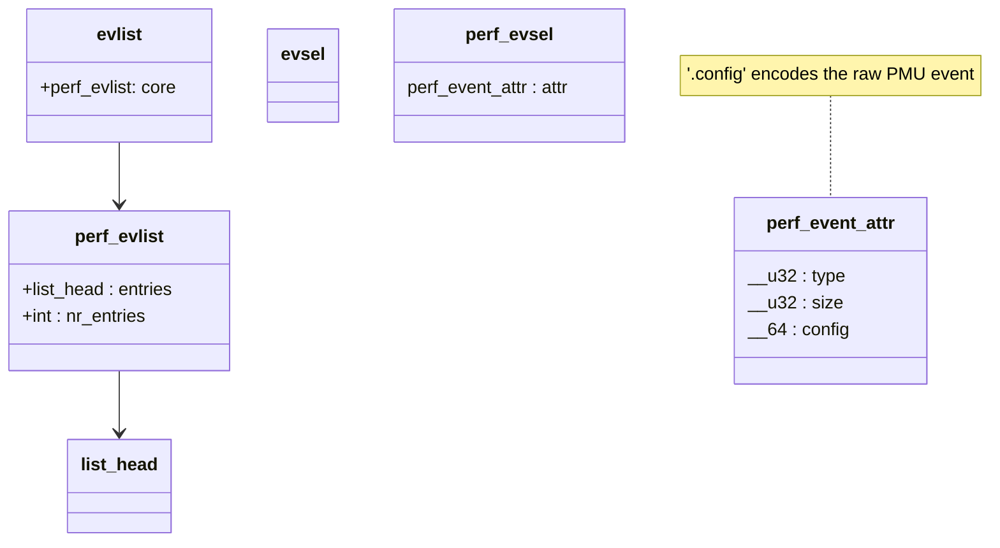

```mermaid
classDiagram
    class evlist {
      +perf_evlist: core
    }

    class evsel
    class perf_evlist {
      +list_head : entries
      +int : nr_entries
    }

    class perf_evsel {
      perf_event_attr : attr
    }

    class perf_event_attr {
      __u32 : type
      __u32 : size
      __64 : config
    }
    note for perf_event_attr "'.config' encodes the raw PMU event"

    class perf_event_attr
    class list_head

    evlist --> perf_evlist
    perf_evlist --> list_head
```
