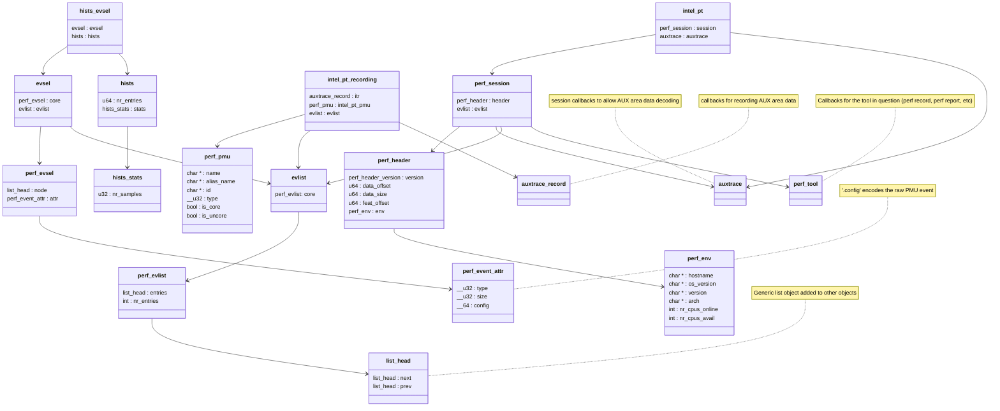

```mermaid
classDiagram
    class evlist {
      perf_evlist: core
    }

    class evsel {
      perf_evsel : core
      evlist : evlist
    }

    class perf_evlist {
      list_head : entries
      int : nr_entries
    }

    class perf_evsel {
      list_head : node
      perf_event_attr : attr
    }

    class perf_event_attr {
      __u32 : type
      __u32 : size
      __64 : config
    }
    note for perf_event_attr "'.config' encodes the raw PMU event"

    class perf_event_attr

    class perf_session {
      perf_header : header
      evlist : evlist
    }

    class perf_header {
      perf_header_version : version
      u64 : data_offset
      u64 : data_size
      u64 : feat_offset
      perf_env : env
    }

    class perf_env {
      char * : hostname
      char * : os_version
      char * : version
      char * : arch
      int : nr_cpus_online
      int : nr_cpus_avail      
    }

    class list_head {
      list_head : next
      list_head : prev
    }
    note for list_head "Generic list object added to other objects"

    class intel_pt {
      perf_session : session
      auxtrace : auxtrace      
    }

    class intel_pt_recording {
      auxtrace_record : itr
      perf_pmu : intel_pt_pmu
      evlist : evlist
    }

    class hists_evsel {
      evsel : evsel
      hists : hists
    }

    class hists {
      u64 : nr_entries
      hists_stats : stats
    }

    class hists_stats {
      u32 : nr_samples
    }

    class auxtrace {
    }
    note for auxtrace "session callbacks to allow AUX area data decoding"

    class auxtrace_record {
    }
    note for auxtrace_record "callbacks for recording AUX area data"

    class perf_pmu {
      char * : name
      char * : alias_name
      char * : id
      __u32 : type
      bool : is_core
      bool : is_uncore
    }

    class perf_tool {
    }
    note for perf_tool "Callbacks for the tool in question (perf record, perf report, etc)"

    %% -------------------------------------------
    %% Define relationships

    evlist --> perf_evlist
    evsel --> perf_evsel
    evsel --> evlist
    perf_evsel --> perf_event_attr
    perf_evlist --> list_head
    perf_session --> perf_header
    perf_session --> auxtrace
    perf_session --> evlist
    perf_session --> perf_tool
    perf_header --> perf_env
    intel_pt --> perf_session
    intel_pt --> auxtrace
    intel_pt_recording --> perf_pmu
    intel_pt_recording --> evlist
    intel_pt_recording --> auxtrace_record
    hists --> hists_stats
    hists_evsel --> evsel
    hists_evsel --> hists
```
