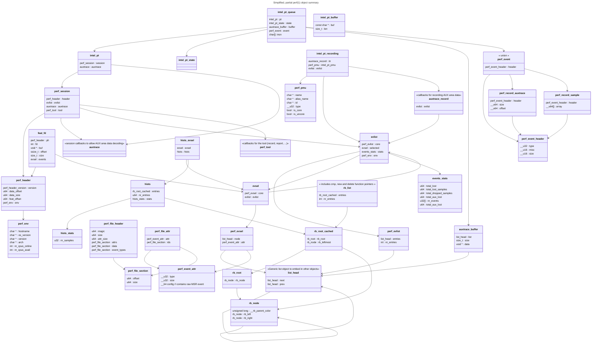

```mermaid
---
title: Simplified, partial perf(1) object summary
---
classDiagram
    class evlist {
      perf_evlist : core
      evsel : selected
      events_stats : stats
      perf_env : env
    }

    class events_stats {
      u64 : total_lost
      u64 : total_lost_samples
      u64 : total_dropped_samples
      u64 : total_aux_lost
      u32[] : nr_events
      u64 : total_aux_lost
    }

    class evsel {
      perf_evsel : core
      evlist : evlist
    }

    class perf_evlist {
      list_head : entries
      int : nr_entries
    }

    class perf_evsel {
      list_head : node
      perf_event_attr : attr
    }

    class perf_event_attr {
      __u32 : type
      __u32 : size
      __64 config // contains raw MSR event
    }

    class perf_session {
      perf_header : header
      evlist : evlist
      auxtrace : auxtrace
      perf_tool : tool
    }

    class perf_header {
      perf_header_version : version
      u64 : data_offset
      u64 : data_size
      u64 : feat_offset
      perf_env : env
    }

    class feat_fd {
      perf_header : ph
      int : fd
      void * : buf
      ssize_t : offset
      size_t : size
      evsel : events
    }

    class perf_file_header {
      u64 : magic
      u64 : size
      u64 : attr_size
      perf_file_section : attrs
      perf_file_section : data
      perf_file_section : event_types
    }

    class perf_file_section {
      u64 : offset
      u64 : size
    }

    class perf_file_attr {
      perf_event_attr : attr
      perf_file_section : ids
    }

    class perf_env {
      char * : hostname
      char * : os_version
      char * : version
      char * : arch
      int : nr_cpus_online
      int : nr_cpus_avail      
    }

    class list_head {
      <<Generic list object to embed in other objects>>
      list_head : next
      list_head : prev
    }

    class intel_pt {
      perf_session : session
      auxtrace : auxtrace      
    }

    class intel_pt_queue {
      intel_pt : pt
      intel_pt_state : state
      auxtrace_buffer : buffer
      perf_event : event
      char[]: insn
    }

    class perf_event_header {
      __u32 : type
      __u16 : misc
      __u16 : size
    }

    class perf_record_auxtrace {
       perf_event_header : header
       __u64 : size
       __u64 : offset
    }

    class perf_record_sample {
       perf_event_header : header
       __u64[] : array
    }

    class perf_event {
      << union >>
       perf_event_header : header

      
    }

    class intel_pt_buffer {
      const char * : buf
      size_t : len
    }

    class auxtrace_buffer {
      list_head : list
      size_t : size
      void * : data
    }

    class intel_pt_recording {
      auxtrace_record : itr
      perf_pmu : intel_pt_pmu
      evlist : evlist
    }

    class hists_evsel {
      evsel : evsel
      hists : hists
    }

    class hists {
      rb_root_cached : entries
      u64 : nr_entries
      hists_stats : stats
    }

    class hists_stats {
      u32 : nr_samples
    }

    class auxtrace {
      <<session callbacks to allow AUX area data decoding>>
    }

    class auxtrace_record {
      <<callbacks for recording AUX area data>>

      evlist : evlist
    }

    class perf_pmu {
      char * : name
      char * : alias_name
      char * : id
      __u32 : type
      bool : is_core
      bool : is_uncore
    }

    class perf_tool {
      <<callbacks for the tool (record, report, ...)>>
    }

    class rb_list {
      << includes cmp, new and delete function pointers >>
      rb_root_cached : entries
      int : nr_entries
    }

    class rb_node {
      unsigned long : __rb_parent_color
      rb_node : rb_left
      rb_node : rb_right
    }

    class rb_root {
      rb_node : rb_node
    }

    class rb_root_cached {
      rb_root : rb_root
      rb_node : rb_leftmost 
    }

    %% -------------------------------------------
    %% Define relationships

    auxtrace_buffer --> list_head
    
    auxtrace_record --> evlist

    evlist --> perf_evlist
    evlist --> evsel
    evlist --> events_stats

    evsel --> perf_evsel
    evsel --> evlist

    feat_fd --> perf_header
    feat_fd --> evsel

    hists --> hists_stats
    hists --> rb_root_cached

    hists_evsel --> evsel
    hists_evsel --> hists

    intel_pt --> perf_session
    intel_pt --> auxtrace

    intel_pt_queue --> intel_pt
    intel_pt_queue --> intel_pt_state
    intel_pt_queue --> auxtrace_buffer
    intel_pt_queue --> perf_event

    intel_pt_recording --> perf_pmu
    intel_pt_recording --> evlist
    intel_pt_recording --> auxtrace_record

    list_head --> list_head

    perf_event --> perf_event_header
    perf_event --> perf_record_auxtrace
    perf_event --> perf_record_sample

    perf_evsel --> list_head
    perf_evsel --> perf_event_attr

    perf_evlist --> list_head

    perf_file_attr --> perf_event_attr
    perf_file_attr --> perf_file_section

    perf_file_header --> perf_file_section

    perf_header --> perf_env

    perf_record_auxtrace --> perf_event_header
    perf_record_sample --> perf_event_header

    perf_session --> perf_header
    perf_session --> auxtrace
    perf_session --> evlist
    perf_session --> perf_tool

    rb_node --> rb_node
    rb_root --> rb_node
    rb_root_cached --> rb_root
    rb_root_cached --> rb_node
    rb_list --> rb_root_cached

```
