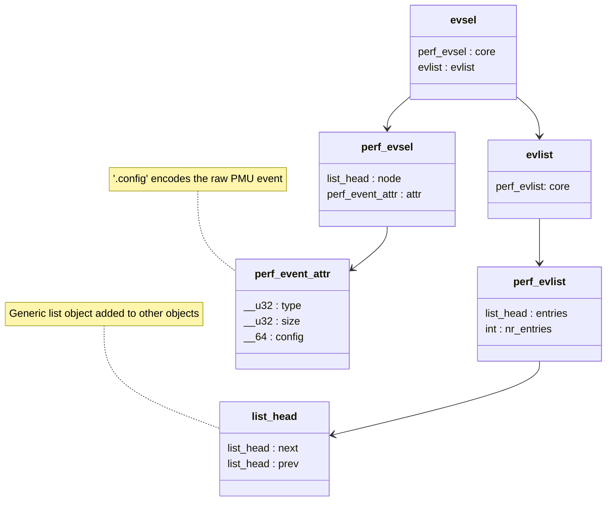

```mermaid
classDiagram
    class evlist {
      perf_evlist: core
    }

    class evsel {
      perf_evsel : core
      evlist : evlist
    }

    class perf_evlist {
      list_head : entries
      int : nr_entries
    }

    class perf_evsel {
      list_head : node
      perf_event_attr : attr
    }

    class perf_event_attr {
      __u32 : type
      __u32 : size
      __64 : config
    }
    note for perf_event_attr "'.config' encodes the raw PMU event"

    class perf_event_attr

    class list_head {
      list_head : next
      list_head : prev
    }
    note for list_head "Generic list object added to other objects"

    %% -------------------------------------------
    %% Define relationships

    evlist --> perf_evlist
    evsel --> perf_evsel
    evsel --> evlist
    perf_evsel --> perf_event_attr
    perf_evlist --> list_head

```
