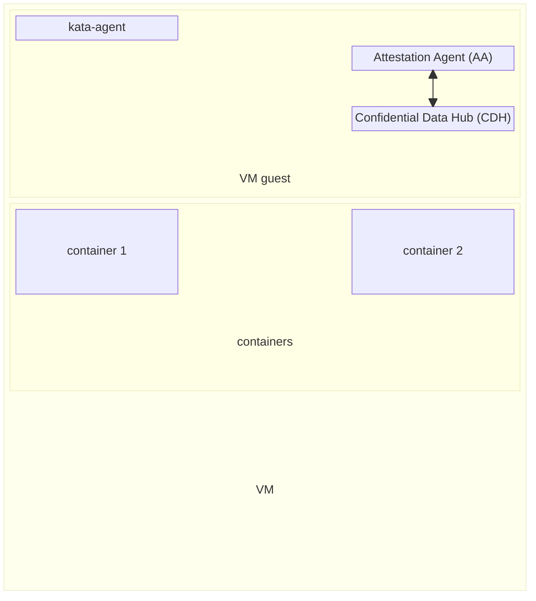

```mermaid
block-beta
  block:vm
    columns 1

    block:guest
      columns 3
      kata_agent["kata-agent"]:1 space:2
      space:2 aa["Attestation Agent (AA)"]
      space:3
      space:2 cdh["Confidential Data Hub (CDH)"]

      %% At the time of writing, mermaid doesn't support
      %% double-ended arrows for block diagrams, so fake it ;)
      aa --> cdh
      cdh --> aa

      space:3
      space guest_label["VM guest"] space

      style guest_label fill:none,stroke:none
    end

    block:pods
      columns 3

      cid_1["container 1"] space cid_2["container 2"]

      space containers_label["containers"] space

      style containers_label fill:none,stroke:none
    end

    vm_label["VM"]

    style vm_label fill:none,stroke:none
  end
```
