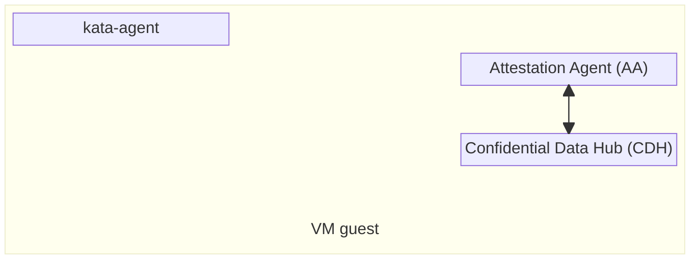

```mermaid
block-beta
  block:vm
    columns 3
    kata_agent["kata-agent"]:1 space:2
    space:2 aa["Attestation Agent (AA)"]
    space:3
    space:2 cdh["Confidential Data Hub (CDH)"]

    %% At the time of writing, mermaid doesn't support
    %% double-ended arrows for block diagrams, so fake it ;)
    aa --> cdh
    cdh --> aa

    space:3
    space label["VM guest"] space

    style label fill:none,stroke:none
  end
```
